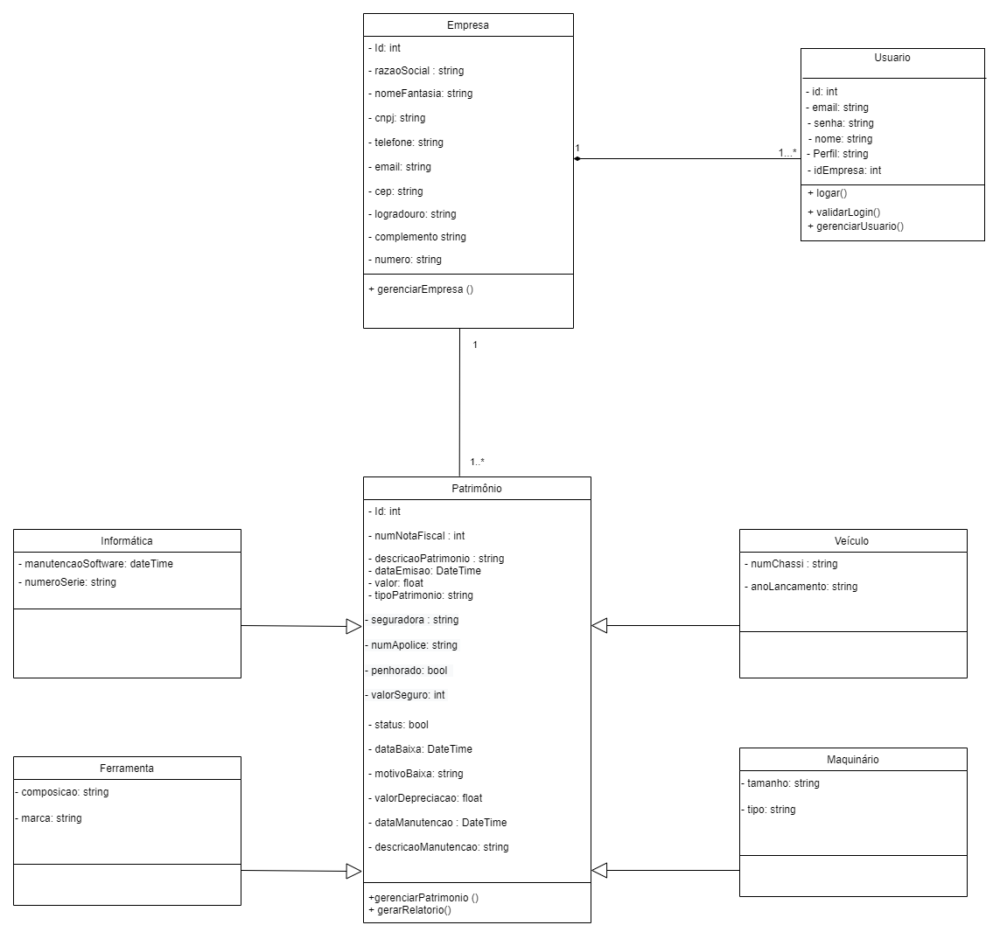
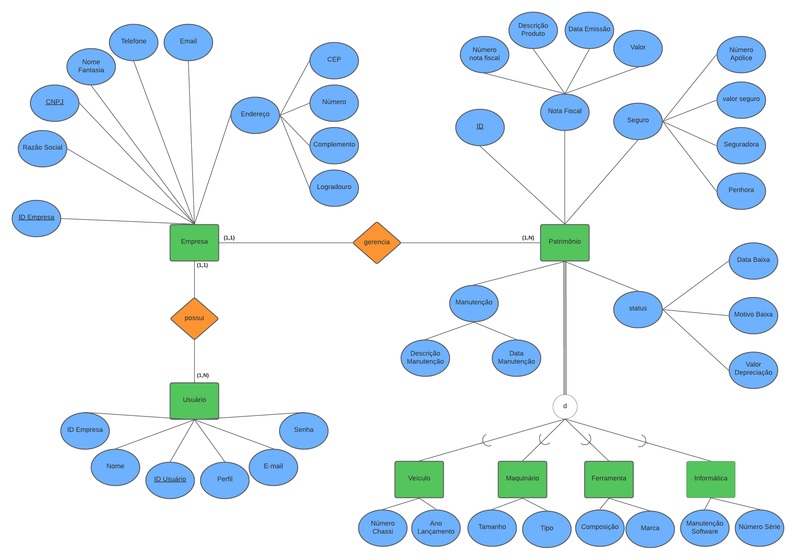

# Arquitetura da Solução

Pré-requisitos: <a href="3-Projeto de Interface.md"> Projeto de Interface</a>

Os componentes que fazem parte da solução são apresentados na figura a seguir. Nela também é possível observar como o fluxo de requisições e respostas são realizados até que seja retornada uma resposta ao usuário. 

O Cliente, através da Interface de Usuário disponibilizada pelo front-end, gera requisições para o back-end. Este leva a requisição ao banco de dados hospedado na Azure. Em seguida, o banco de dados retorna uma resposta ao back-end que, por sua vez, responde ao cliente através da interface do front-end. 

## Diagrama de Classes

O diagrama de classes ilustra graficamente como será a estrutura do software, e como cada uma das classes da sua estrutura estarão interligadas. Essas classes servem de modelo para materializar os objetos que executarão na memória.

## Modelo ER (Projeto Conceitual)

O Modelo ER representa através de um diagrama como as entidades (coisas, objetos) se relacionam entre si na aplicação interativa.

## Projeto da Base de Dados

O projeto da base de dados corresponde à representação das entidades e relacionamentos identificadas no Modelo ER, no formato de tabelas, com colunas e chaves primárias/estrangeiras necessárias para representar corretamente as restrições de integridade.
 

## Tecnologias Utilizadas

* IDE: Visual Studio 
* Linguagens utilizadas no Front-end: Html, css, javascript
* Framework Front-end: Bootstrap 
* Linguagem utilizada no Back-end: C#
* Framework para integração entre back-end e banco de dados: Entity Framework 
* Banco de Dados: Microsoft SQL Server 
* Servidor em nuvem para banco de dados:  Azure 
* Versionamento: Git

## Hospedagem

Hospedaremos o site em etapas posteriores através da Azure.
